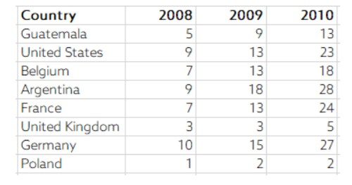
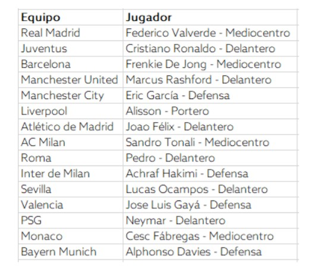
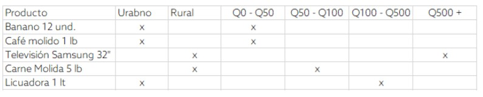

Examen final
================

## **Pregunta 1**

### ¿Qué es una expresión regular?

Las expresiones regulares son unidades de descripción del lenguaje
regular. Estas sirven para el análisis del lenguaje en el mundo de la
informática, porque nos permite identificar, sistituír o verificar
palabras o textos completos para un análisis posterior. También son
conocidas como “Regex” y el uso que más se les brindó en este curso fue
para simplificar textos y categorizar observaciones con base a nuevas
variables obtenidas con dichas regex.

## **Pregunta 2**

### Enumere y explique brevemente cuatro aplicaciones prácticas en las cuales

las expresiones regulares son utilizadas.

1.  Crear nuevas variables categóricas
2.  identificar palabras dentro de un texto (ej. identificar cierta
    palabra dentro de la columna de descripcion en una base de datos de
    productos)
3.  Indentificar una palabra con todas sus posibles formas en que se
    ingresó (ej. el mes de enero: Ene, Jan, Enero, january, etc.)
4.  Análisis de sentimientos: ver cuantas veces aparece cierta palabra
    en un texto para identificar si un cliente está enojado, alegre,
    disgustado, triste, etc. Esto permite automatizar respuestas y
    conocer mejor al cliente.

## **Pregunta 3**

### Explique brevemente las 3 condiciones que establecen que una tabla se

encuentra en formato tidy.

1.  *Cada variable es una columna*: No pueden haber columnas que sean
    parte de la misma variable, por ejemplo, una tabla que esté
    codificada con OneHot encoding no estaría en formato *tidy* pues las
    categorías de una variable categórica estarían en más de una
    columna.
2.  *Cada observación forma una fila*: Significa que en una misma fila
    no puede haber un elemento que haga referencia a dos observaciones o
    tratamientos. Esto significaría que la variable para dicho
    tratamiento u observación se está colocando en más de una columna,
    violando el primer supuesto.
3.  *Cada tabla se compone de una unidad observacional*: Cada variable
    que haga referencia a un valor de algúna observación o tratamiento
    debe tener la misma unidad de medida dentro de esa columna y debe
    ser la misma unidad observacional.

## **Pregunta 4**

### Diagnostique y explique por qué la siguiente tabla no está en formato tidy.

Luego, explique cómo convertirla a formato tidy. (7 pts)

 La tabla no esta en formato tidy porque
viola el primer supuesto, que establece que cada variable es una
columna. En este caso tenemos la variable de “Año” desplazada por cada
columna de la tabla, en donde sus categorías (2008,2009, 2010) son las
columnas. Para convertirla a formato tidy podemos usar la función
`gather()` de la libreria *tidyr* de R en donde la llave o “Key” sería
“Año” y el valor o “Value” serían los valores numericos. De esta manera
cada fila de la tabla sería una sola observación. Cada país tendría 3
observaciones, una por año.

## **Pregunta 5**

### Diagnostique y explique por qué la siguiente tabla no está en formato tidy.

Luego, explique cómo convertirla a formato tidy. (7 pts)

 Esta tabla viola el tercer supuesto para
que sea tidy, pues en una sola columna se estan registrando más de una
unidad observacional. Esta en nombre del jugador y la posición en la que
juega. Para corregirla a formato tidy podemos hechar mano de las regex y
separar la columna Jugador en dos cada que encuentre ’ - ’ en el texto
de dicha columna. El nombre de la segunda columna sería Posicion, y la
tabla estaría en formato tidy.

## **Pregunta 6**

### Diagnostique y explique por qué la siguiente tabla no está en formato tidy.

Luego, explique cómo convertirla a formato tidy. (7 pts)

 Esta tabla igualmente viola el supuesto
en el que cada variable es una columna. Tenemos dos columnas que son
categorías de la misma variable (Urbano y Rural son categorías de Area)
y las ultimas cuatro columnas son intervalos que pueden ser tomados como
categorías de la variable Precio. Para arreglarlo podemos usar
igualmente la función `gather()` de *tidyr*, primero para Area y luego
para Precio.

## **Pregunta 7**

### Sobre lubridate: Explique la diferencia entre las funciones period y las

funciones duration. (5 pts)

La función `period()` nos permite registrar un lapso de tiempo en
periodos grandes como meses o años. Esta función reconoce la diferencia
de días entre meses, por lo que registra que de Julio 1 a Agosto 1 hay
un mes, y de igual forma de Febrero 1 a Marzo 1 también hay un mes.

La función de `duration()` sí toma en cuenta las unidades más pequeñas
como segundos o días.

## **Pregunta 8**

### ¿En qué contexto utilizaría una función period y en cúal utilizaría una

función duration? (5 pts)

Utilizaría duration() para saber cuantos días han pasado desde el último
eclipse lunar. Utilizaría period() para saber cuantos meses han pasado
desde la Segunda Guerra Mundial.

## **Pregunta 9**

### Explique el concepto de data Missing Completely at Random (MCAR). (6 pts)

Significa que la probabilidad de que una observación tenga un valor
faltante en una variable no tiene nada que ver con el sujeto de estudio.
Es decir, los valores faltantes están distribuidos aleatoriamente.

## **Pregunta 10**

### Si logramos verificar que la data faltante es MCAR, ¿cuál imputación

recomendaría utilizar? (5 pts)

Lo que recomiendo es utilizar una imputaqción por la media/mediana/moda,
dependiendo de la distribución de la variable. Si es muy sesgada, la
media no será un buen parámetro para imputar, pues está sesgada.

## **Pregunta 11**

### .Si estamos realizando el análisis de una encuesta en la cual tenemos

información sobre 150 individuos y tenemos valores faltantes en
diferentes variables de nuestra tabla, ¿cúal de los siguientes métodos
utilizaría y por qué? (6 pts)

2.  pairwise deletion.

Porque si sabemos que diferentes variables están siendo omitidas por los
individuos, hacer un listwise deleiton reduciría nuestro número de
observaciones significativamente.

## **Pregunta 12**

### Usted se encuentra realizando un modelo sobre la capacidad necesaria que

necesita para atender la demanda de transporte de un producto
determinado. Se requiere que cumpla con el 90% de la demanda mensual.
¿Cúal de los siguientes métodos utilizaría para determinar con qué
población de sus datos trabajar? (6 pts)

4.  outliers cap via percentile approach.

Porque esto nos permite trabajar directamente con los datos que estén
debajo del 90% de nuestra distribución de densidad de población. Elimina
los outliers y cumple con el requisito de trabajar con el 90% de la
demanda mensual.

## **Pregunta 13**

### ¿En qué contexto de Machine Learning se recomienda utilizar Min Max

Scaling?

Si queremos hacer un modelo de predicción en donde las variables
predictoras estén en una escala que difiera sustancialmente entre las
diferentes variables de nuestro modelo. Porque al realizar nuestro
modelo con los valores origniales estamos dandole más peso o importancia
a algunas variables, pues contribuyen más dada su gran escala. El MinMax
Scaling resuelve esto, dejandonos trabajar con las mismas variables en
un rango de 0 a 1.

## **Pregunta 14**

### Si encuentra que la distribución de sus datos tiene un comportamiento

exponencial, ¿cúal técnica de normalización utilizaría para transformar
los datos a una distribución normal? (5 pts)

Log sclae transformation. Porque nos permite normalizar un set de datos
sin tomar en cuenta que la diferencia de escalas es muy grande entre el
minimo y maximo.

## **Pregunta 15**

### Si se tiene una variable categórica con tres niveles, cúantas variables dummy

necesita para poder pasar la data a un modelo econométrico o de machine
learning? (5 pts)

Solamente dos, para evitar la multicolinealidad. Evitando así la Dummy
Trap.

## **Pregunta 16**

### ¿En cuál contexto utilizamos one hot encoding?

Nos sirve para pasar la data a un modelo de ML o AI. O simplemente para
hacer un conteo por columnas, que nos indicaría la cantidad de
observaciones por cada nivel.

## **Pregunta 17**

### ¿Qué es un n-gram?

Es un diagrama que nos permite ver en términos de probabilidades las
posibles secuencias de un elemento. Se utilizar bastante para análisis
de texto, y el ejemplo claro es la recomendación del teclado de los
iPhones. Esta recomendación se basa en la probabilidad de que cierta
palabra sea utilizada despues de otra.

## **Pregunta 18**

### .Si quiero obtener como resultado las filas de la tabla A que no se encuentran

en la tabla B, ¿cómo debería de completar la siguiente sentencia de SQL?

SELECT \* FROM A LEFT JOIN B ON A.KEY = B.KEY WHERE A!=B
