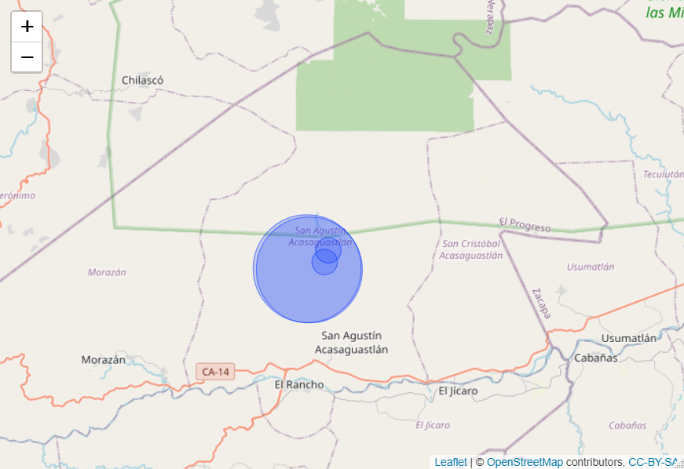

## Sumario de la investigación

Este reporte tiene como objetivo entender, por medio de los datos brindados, cómo funcionó el periodo del 2017 para la empresa Inversiones en Energía, S.A. y de esta manera utilizar estos hallazgos para mejorar la estrategia de las operaciones futuras. Se presentará primero un Estado de Resultados breve del 2017 y luego se procederá a entender, por medio del comportamiento en volumen de servicios, tipo de servicios, recorridos, unidades de transporte y costos, qué fue lo que hizo que este año fuera tan exitoso; al igual que cosas que se pueden mejorar.

```{r, echo=FALSE, eval=TRUE, results='hide', message=FALSE, warning=FALSE}
# IMPORTANTO LIBRERIAS Y DATOS
library(dplyr)
library(lubridate)
library(tidyr)
library(stringr)
library(ggplot2)
library(leaflet)
library(ggQC)
library(scales)

data <- read.csv('c1.csv')

########## PREP. Y LIMPIEZA DE DATOS #################

# Eliminando las ultimas 6 variables que son basura
data <- data %>% select(!c(X,X.1, X.2, X.3, X.4, X.5))

# Poner fecha en formato yyyy-mm-dd
data$Fecha <- dmy(data$Fecha)

# Quitarle el signo de Q- a todas las columnas
data <- data %>% 
  mutate(Camion_5=gsub(pattern = 'Q-', replacement = NA, x = Camion_5),
         Pickup=gsub(pattern = 'Q-', replacement = NA, x = Pickup),
         Moto=gsub(pattern = 'Q-', replacement = NA, x = Moto))

# Unir columnas Moto, camion y pickup a una sola variable (Tipo de unidad)
data <- data %>% 
  gather(Tipo.unidad, Costo, Camion_5:Moto, factor_key = TRUE) %>% 
  na.omit()

# Quitandole "Q" a Costo y pasandolo a numerico
data <- data %>% 
  mutate(Costo=gsub(pattern = "Q", replacement = "", x = Costo))
data$Costo <- as.numeric(data$Costo)

### Unir columnas de costos directos y costos fijos de cada unidad
## Costos directos
data <- data %>% 
  mutate(directoCamion_5=gsub(pattern = 'Q-', replacement = NA, x = directoCamion_5),
         directoPickup=gsub(pattern = 'Q-', replacement = NA, x = directoPickup),
         directoMoto=gsub(pattern = 'Q-', replacement = NA, x = directoMoto))
# Unir columnas directoMoto, directoCamion_5 y directoPickup a una sola variable (cto_directo)
data <- data %>% 
  gather(Tipo, cto_directo, directoCamion_5:directoMoto, factor_key = TRUE) %>% 
  na.omit() %>% 
  select(!Tipo)
# Quitandole "Q" a cto_directo y pasandolo a numerico
data <- data %>% 
  mutate(cto_directo=gsub(pattern = "Q", replacement = "", x = cto_directo))
data$cto_directo <- as.numeric(data$cto_directo)

## Costos fijos
data <- data %>% 
  mutate(fijoCamion_5=gsub(pattern = 'Q-', replacement = NA, x = fijoCamion_5),
         fijoPickup=gsub(pattern = 'Q-', replacement = NA, x = fijoPickup),
         fijoMoto=gsub(pattern = 'Q-', replacement = NA, x = fijoMoto))
# Unir columnas directoMoto, directoCamion_5 y directoPickup a una sola variable (cto_directo)
data <- data %>% 
  gather(Tipo, cto_fijo, fijoCamion_5:fijoMoto, factor_key = TRUE) %>% 
  na.omit() %>% 
  select(!Tipo)
# Quitandole "Q" a cto_fijo y pasandolo a numerico
data <- data %>% 
  mutate(cto_fijo=gsub(pattern = "Q", replacement = "", x = cto_fijo))
data$cto_fijo <- as.numeric(data$cto_fijo)

### Unir intervalos de minutos de distancia a una sola variable
data <- data %>% 
  mutate(X5.30=gsub(pattern = "  ", replacement = NA, x = X5.30),
         X30.45=gsub(pattern = "  ", replacement = NA, x = X30.45),
         X45.75=gsub(pattern = "  ", replacement = NA, x = X45.75),
         X75.120=gsub(pattern = "  ", replacement = NA, x = X75.120),
         X120.=gsub(pattern = "  ", replacement = NA, x = X120.)
         )
# Unir intervalos de distancia en una columna "Distancia_min"
data <- data %>% 
  gather(Distancia_min, temp, X5.30:X120. , factor_key = TRUE) %>% 
  na.omit() %>% 
  select(!temp)
# Quitandole la 'X' y cambiando . por -
data <- data %>% 
  mutate(Distancia_min = str_replace_all(Distancia_min, 
                                         c("X" = "", '\\.' = "-")))

### Factura
data <- data %>% 
  mutate(factura=gsub(pattern = "Q", replacement = "", x = factura))
data$factura <- as.numeric(data$factura)

### Pasando Cod, origen, height y Distancia_min a FACTOR
data <- data %>% 
  mutate(Cod = as.factor(Cod),
         origen = as.factor(origen),
         height = as.factor(height),
         Distancia_min = as.factor(Distancia_min))

# Campo calculado de ingreso
data$Ingreso <- data$factura - data$Costo
#################################################################################
```

## Entendiendo los datos

El dataset que se utilizó para este reporte contiene 14 variables:

* ID: *código de identificación del poste al que se le dió el servicio*
* Cod: *Tipo de servicio que se brindó. Ej. Revisión, Cambio correctivo, etc.*
* origen: *La identificación de cada centro de distribución (4 en total)*
* factura: *Valor de la factura en Q. (Precio de venta del servicio)*
* height: *Altura del poste*
* Tipo.unidad: *Se refiere a unidad de transporte (Moto, Pickup o Camión)*
* Distancia_min: *Distancia recorrida. Intervalos de tiempo en mins*
* Ingreso: *factura - Costo*


```{r}
str(data)
```

## Análisis de la situación

### Estado de resultados
```{r echo=FALSE, eval=TRUE}
Total.facturacion <- sum(data$factura)
Total.cto_directo <- sum(data$cto_directo)
Total.cto_fijo <- sum(data$cto_fijo)
Utilidad.operativa <- Total.facturacion - Total.cto_directo - Total.cto_fijo
margen.operativo <- Utilidad.operativa/Total.facturacion *100
cat('Ingresos Totales   ', round(Total.facturacion,0), '\n',
    'Costo Directo      ', round(Total.cto_directo,0), '\n',
    'Costo Fijo         ', round(Total.cto_fijo,0), '\n',
    'Utilidad Operativa ', round(Utilidad.operativa,0), '\n',
    'Margen Operativo   ', paste0(round(margen.operativo,0), ' %'))
```
### ¿Cómo se comportó la utilidad operativa mensual a lo largo del año?

```{r eval=TRUE, echo=FALSE, message=FALSE, results='hide'}
## CREANDO LAS DOS TABLAS NECESARIAS PARA GRAFICAR
# Tabla de Utilidades agrupadas por Centro de Distribución
utilidades.por.origen <- data %>% select(Fecha, origen, factura, Costo) %>% 
  group_by(Fecha, origen) %>% summarise(Facturacion.Tot=sum(factura),
                                        Costo.Tot = sum(Costo)) %>% 
  mutate(Profit = Facturacion.Tot-Costo.Tot)
# Lo quiero mensual, este comando es para quitar los dias de la fecha y
# agrupar por mes
utilidades.por.origen$Fecha <- format(as.Date(utilidades.por.origen$Fecha,
                                              "%Y-%m-%d"), "%Y-%m")
utilidades.por.origen <- utilidades.por.origen %>% 
  group_by(Fecha, origen) %>% summarise(Utilidad.mensual = sum(Profit))
# Tabla utilidad mensual por todos los CD
utilidad.mensual <- utilidades.por.origen %>% group_by(Fecha) %>% 
  summarise(Utilidad = sum(Utilidad.mensual))

```
Esta gráfica de línea muestra la estacionalidad de las utilidades operativas. En primera instancea vemos una gran caída en febrero, y una recuperación en marzo.
```{r echo=FALSE, eval=TRUE}
ggplot(utilidad.mensual, aes(Fecha, Utilidad, group=1)) + geom_line(lwd=.6)+
  geom_point(color='red') + 
  theme(axis.text.x = element_text(angle = 75, vjust = 1, hjust=1))+
  scale_y_continuous(labels = label_number(suffix = " K", scale = 1e-3, prefix = "Q."))+
  labs(title = "Utilidad operativa mensual", 
       subtitle = "Sustancial caída en febrero 2017 y picos cada 2 meses")

```

Existen 4 centros de distribución en la empresa. Vemos en ésta gráfica las utilidades operativas de cada uno. Hay una diferencia sustancial con las primeras dos y las ultimas dos.
```{r echo=FALSE, eval=TRUE}
ggplot(utilidades.por.origen,aes(x=Fecha,y=Utilidad.mensual,group=origen))+
  geom_line(aes(color=origen)) +
  geom_point(aes(color=origen))+
  theme(axis.text.x = element_text(angle = 75, vjust = 1, hjust=1))+
  scale_y_continuous(labels = label_number(suffix = " K", scale = 1e-3, prefix = "Q."))+
  labs(title = "Utilidad operativa mensual por centro de distribución", 
       subtitle = "Diferencia significativa entre los primeros dos y ultimos dos centros")
```

También podemos ver que la caída en febrero se dió simultáneamente en los 4 centros de distribución. De hecho, las utilidades mensuales durante todo el año variaron de igual manera para los cuatro centros.

En esta grafica se visualiza la cantidad de servicios promedio que se brinda desde cada centro de distribución. Podemos ver de forma más clara que los últimos dos no tienen mayor demanda.
```{r echo=FALSE, eval=TRUE}
## Promedio mensual de servicios por origen
Por.origen <- data %>% group_by(origen, Mes = month(Fecha)) %>% 
  summarise(Freq= n()) %>% 
  summarise(Promedio=round(mean(Freq),0))
# Bar chart
ggplot(data = Por.origen, mapping = aes(x = reorder(origen, -Promedio), y = Promedio))+
  geom_bar(stat = 'identity', fill='dodgerblue3')+
  scale_y_continuous(labels = comma, 
                     breaks = seq(1000, 9000, 1500))+
  labs(title = "Promedio de servicios mensuales por Centro Dist.", 
       x = "Centro de Distribucion",
       y = "Promedio de servicios al mes")+
  theme_classic()

```

#### ¿A qué se debe esta correlación en utilidades operativas de los 4 centros de distribución?

Si analizamos las áreas en donde opera cada centro de distribución (origen) podemos notar que práticamente las locaciones en donde cada uno brinda servicios son las mismas. Este mapa muestra la región en donde cada centro opera. Cada circulo es un centro de distribución y su radio está determinado por la cantidad de servicios anuales.

```{r echo=TRUE, eval=FALSE}
### Mapa de areas en que opera cada centro de distribucion
coordenadas <- data %>% 
  group_by(origen) %>% 
  summarise(Lat = mean(Lat),
            Long = mean(Long),
            Cantidad = n()) %>% 
  mutate(Peso = Cantidad/nrow(data)*100)

leaflet(coordenadas) %>% addTiles() %>%
  addCircles(lng = ~Long, lat = ~Lat, weight = 1,
             radius = ~Peso * 100, popup = ~origen
  )
```

Las utilidades operativas mensuales se ven afectadas de la misma manera en los cuatro centros de distribución porque la caída en la demanda de servicios de esta región representa una caída en las utilidades de los cuatro centros. Es por esto que mi recomendación es que se trasladen las operaciones de los dos centros de distribución con menor demanda de servicios (150278 y 150841) a otra región. Esto les permitirá estar más diversificados en cuanto a sus locaciones y que las utilidades operativas de la empresa no dependan de la demanda de solo una región.


### Análisis de servicios facturados y utilidades

Ahora analicemos la cantidad en Q. que se factura por recorrido. El recorrido está dado por 5 intervalos que representan la distancia en minutos que se tarda la unidad de transporte en llegar al poste para darle el servicio necesario.
```{r echo=FALSE, eval=TRUE}
# Con que recorridos se factura mas? y con que unidades?
recorridos.unidades <- data %>% 
  group_by(Distancia_min, Tipo.unidad) %>% 
  summarise(Utilidades = sum(Ingreso),
            Facturacion = sum(factura))
# Bar chart
ggplot(data = recorridos.unidades, 
       mapping = aes(x = reorder(Distancia_min, -Facturacion), 
                     y = Facturacion))+
  geom_bar(stat = 'identity', fill='seagreen4')+
  scale_y_continuous(labels = label_number(prefix = "Q.", suffix = " M", 
                                           scale = 1e-6),
                     breaks = seq(0, 18e+6, 2e+6))+
  labs(title = "Facturación por recorrido", x = "Recorrido (Intervalo de distancia en mins)",
       y = "Facturación")
```

Vemos que, por mucho, la mayor cantidad de facturación se hace por servicios a 75-120 minutos de distancia.
Ahora veamos si este orden de montos facturados por recorrido prevalece si se hace la misma gráfica pero en vez de la facturación, se analizan las utilidades.

```{r echo=FALSE, eval=TRUE}
# Cantidad de servicios mensuales primedio por recorrido
ggplot(data = recorridos.unidades,
       mapping = aes(x = reorder(Distancia_min, -Facturacion),
                     y = Utilidades))+
  geom_bar(stat = 'identity', fill='slateblue')+
  scale_y_continuous(labels = label_number(prefix = "Q.", suffix = " M", 
                                           scale = 1e-6),
                     breaks = seq(0, 4e+6, 0.5e+6))+
  labs(title = "Utilidades por recorrido", x = "Recorrido (Intervalo de distancia en mins)",
       y = "Utilidades")
```

El mayor monto de utilidades sigue siendo de los servicios brindados a 75-120 minutos de distancia, pero vemos que el segundo recorrido que más factura (120 minutos o más) es el que menos utilidades representa para la empresa. De igual manera, el recorrido de 45-75 brinda menos utilidades en proporcion a lo que factura.

Para ver qué esta pasando con las utilidades por recorrido debemos analizar los costos de dicho recorrido. Para esto vamos a tomar en cuenta también el tipo de unidad de transporte que se usa. De inmediato podemos notar que el recorrido con mayor costo promedio es el de la distancia de 120 minutos o más. También podemos ver que el costo promedio de hacer un viaje de 120 mins o más con camión es mayor al costo promedio de hacer el mismo viaje con pickup o moto. Esto no es igual a los demás recorridos, pues el costo promedio de cada recorrido es muy similar entre los tipos de unidad de transporte.

```{r echo=FALSE, eval=TRUE}
costos <- data %>% 
  group_by(Tipo.unidad, Distancia_min) %>% 
  summarise(Costo.promedio = mean(Costo))

ggplot(costos, aes(fill=Tipo.unidad, 
                   y=Costo.promedio, 
                   x=reorder(Distancia_min, -Costo.promedio))) + 
  geom_bar(position="dodge", stat="identity")+
  labs(title = "Costo promedio por recorrido y unidad de transporte", 
       x = "Recorrido (Intervalo de distancia en mins)",
       y = "Costo promedio")
```


Ahora regresemos a analizar más a detalle la facturación. Para el recorrido de 120+ mins vemos que lo que más se factura son servicios los cuales se hacen, en su mayoría, con camiones; los cuales tienen un costo promedio mayor.
```{r echo=FALSE, eval=TRUE}
ggplot(recorridos.unidades, aes(fill=Tipo.unidad, 
                 y=Facturacion, 
                 x=reorder(Distancia_min, -Facturacion))) + 
  geom_bar(position="fill", stat="identity")+
  scale_y_continuous(labels = label_number(suffix = "%", 
                                           scale = 100))+
  labs(title = "Facturación por recorrido y unidad de transporte", 
       subtitle = "Grafica de barras apiladas al 100%",
       x = "Recorrido (Intervalo de distancia en mins)",
       y = "Facturacion")

```

La estrategia que propongo con base a este hallazgo es que se traten de minimizar los viajes con camión en los recorridos de 120 minutos o más, reemplazandolos por viajes con pickups, que tienen un menor costo promedio. Lo ideal sería que se hagan más en moto, pero es entendible que la moto solo se trate de utilizar para recorridos más cortos, por su limitada capacidad de carga de equipo necesario para las reparaciones, revisiones, etc.

### Información adicional

#### Análisis de Pareto (80/20)

```{r echo=FALSE, eval=TRUE}
por.servicios <- data %>% group_by(Cod) %>% 
  summarise(Utilidades = sum(Ingreso)) %>% 
  mutate(Cod = gsub(pattern = "_", replacement = " ", x = Cod))


ggplot(por.servicios, aes(x = Cod, y = Utilidades)) +
  stat_pareto(point.color = "red",
              point.size = 3,
              line.color = "black",
              bars.fill = c("blue", "orange")) +
  theme(axis.text.x = element_text(angle = 45, hjust = 1, vjust=1))+
  labs(title = "Gráfica de Pareto", x = "Servicio",
       y = "Utilidades")+
  geom_vline(xintercept = 'CAMBIO FUSIBLE', lwd=0.6, color='red')
  
```

Como información adicional, los servicios que representaron el 80% de las utilidades fueron los primeros 5 de la gráfica, con una predominancia de las revisiones.


