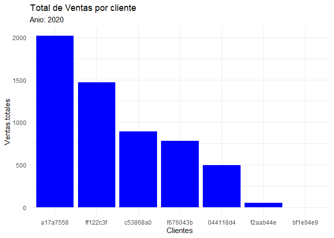

dw-2020-parcial-1
================
Tepi
9/3/2020

# Examen parcial

Indicaciones generales:

-   Usted tiene el período de la clase para resolver el examen parcial.

-   La entrega del parcial, al igual que las tareas, es por medio de su
    cuenta de github, pegando el link en el portal de MiU.

-   Pueden hacer uso del material del curso e internet (stackoverflow,
    etc.). Sin embargo, si encontramos algún indicio de copia, se
    anulará el exámen para los estudiantes involucrados. Por lo tanto,
    aconsejamos no compartir las agregaciones que generen.

## Sección I: Preguntas teóricas.

-   Existen 10 preguntas directas en este Rmarkdown, de las cuales usted
    deberá responder 5. Las 5 a responder estarán determinadas por un
    muestreo aleatorio basado en su número de carné.

-   Ingrese su número de carné en `set.seed()` y corra el chunk de R
    para determinar cuáles preguntas debe responder.

``` r
set.seed(20190285) 
v<- 1:10
preguntas <-sort(sample(v, size = 6, replace = FALSE ))

paste0("Mis preguntas a resolver son: ",paste0(preguntas,collapse = ", "))
```

    ## [1] "Mis preguntas a resolver son: 2, 3, 6, 7, 8, 10"

### Listado de preguntas teóricas

2.  Al momento de filtrar en SQL, ¿cuál keyword cumple las mismas
    funciones que el keyword `OR` para filtrar uno o más elementos una
    misma columna?

**IN**

3.  ¿Por qué en R utilizamos funciones de la familia apply
    (lapply,vapply) en lugar de utilizar ciclos?

**Porque la ventaja de usar la familia apply es que aprovechamos que las
operaciones sean vectorizadas. En vez de realizar operaciones elemento
por elemento, la aplicamos en vectores, lo cual hace que sea más
eficiente.**

6.  ¿Qué es un vector y en qué se diferencia en una lista en R?

**Son objetos de una dimension que pueden contener valores numericos,
logicos o de caracteres; sin embargo, no pueden contener datos de
distinto tipo a la vez. Son los objetos mas utilizados en estructuras de
datos. La diferencia de estos con las listas, es que las listas son
objetos que contienen otros objetos en sus elementos, es decir, pueden
contener vectores, matrices, fucniones, dataframes, etc. en cada uno de
sus elementos.**

7.  ¿Qué pasa si quiero agregar una nueva categoría a un factor que no
    se encuentra en los niveles existentes?

**Si se puede agregar otra categoria con la funcion `levels()`.
Ejemplo:**

``` r
categorias <- as.factor(iris$Species)
levels(categorias) <- c(levels(categorias), "unknown") # le agregamos la categoria Unkown
levels(categorias)
```

    ## [1] "setosa"     "versicolor" "virginica"  "unknown"

8.  Si en un dataframe, a una variable de tipo `factor` le agrego un
    nuevo elemento que *no se encuentra en los niveles existentes*,
    ¿cuál sería el resultado esperado y por qué?
    -   El nuevo elemento
    -   `NA`

**El resultado de ese elemento seria `NA`, pues no reconoce ninguna
categoria que coincida con el del nuevo elemento.**

``` r
mtcars$cyl <- as.factor(mtcars$cyl)
x <- c(21, "10", 160, 110, 3.9, 2.5, 17, 0, 1, 4, 4)
x <- rbind(mtcars, x)
```

    ## Warning in `[<-.factor`(`*tmp*`, ri, value = "10"): invalid factor level, NA
    ## generated

``` r
tail(x)
```

    ##                 mpg  cyl disp  hp drat    wt qsec vs am gear carb
    ## Lotus Europa   30.4    4 95.1 113 3.77 1.513 16.9  1  1    5    2
    ## Ford Pantera L 15.8    8  351 264 4.22  3.17 14.5  0  1    5    4
    ## Ferrari Dino   19.7    6  145 175 3.62  2.77 15.5  0  1    5    6
    ## Maserati Bora    15    8  301 335 3.54  3.57 14.6  0  1    5    8
    ## Volvo 142E     21.4    4  121 109 4.11  2.78 18.6  1  1    4    2
    ## 33               21 <NA>  160 110  3.9   2.5   17  0  1    4    4

10. Si quiero obtener como resultado las filas de la tabla A que no se
    encuentran en la tabla B, ¿cómo debería de completar la siguiente
    sentencia de SQL?

    -   SELECT \* FROM A LEFT OUTER JOIN B ON A.KEY = B.KEY WHERE
        A.col\_name &lt;&gt; B.col\_name

Extra: ¿Cuántos posibles exámenes de 5 preguntas se pueden realizar
utilizando como banco las diez acá presentadas? (responder con código de
R.)

``` r
# Es un problema de combinaciones
# ____n!______
#   r!(n-r)!

factorial(10)/(factorial(5)*factorial(10-5))
```

    ## [1] 252

## Sección II Preguntas prácticas.

-   Conteste las siguientes preguntas utilizando sus conocimientos de R.
    Adjunte el código que utilizó para llegar a sus conclusiones en un
    chunk del markdown.

A. De los clientes que están en más de un país,¿cuál cree que es el más
rentable y por qué?

B. Estrategia de negocio ha decidido que ya no operará en aquellos
territorios cuyas pérdidas sean “considerables”. Bajo su criterio,
¿cuáles son estos territorios y por qué ya no debemos operar ahí?

### I. Preguntas teóricas

## A

``` r
library(dplyr)
```

    ## 
    ## Attaching package: 'dplyr'

    ## The following objects are masked from 'package:stats':
    ## 
    ##     filter, lag

    ## The following objects are masked from 'package:base':
    ## 
    ##     intersect, setdiff, setequal, union

``` r
library(ggplot2)
library(lubridate)
```

    ## 
    ## Attaching package: 'lubridate'

    ## The following objects are masked from 'package:base':
    ## 
    ##     date, intersect, setdiff, union

``` r
parcial_anonimo <- readRDS("parcial_anonimo.rds")

por.numero.paises <- parcial_anonimo %>% group_by(Cliente, Pais) %>% summarise(n = n()) %>%  
   group_by(Cliente) %>% summarise(n.pais= n()) %>% filter(n.pais > 1)
```

    ## `summarise()` has grouped output by 'Cliente'. You can override using the `.groups` argument.

``` r
clientes <- left_join(por.numero.paises,parcial_anonimo)
```

    ## Joining, by = "Cliente"

``` r
clientes$Year <- year(clientes$DATE)
clientes <- clientes %>% group_by(Cliente, Year) %>% summarise(Unidades = sum(`Unidades plaza`), Ventas.totales = sum(Venta))
```

    ## `summarise()` has grouped output by 'Cliente'. You can override using the `.groups` argument.

``` r
clientes.2020 <- clientes %>% filter(Year==2020)

ggplot(data = clientes.2020, mapping = aes(x = reorder(Cliente, -Ventas.totales), y = Ventas.totales)) + 
  geom_bar(stat="identity", fill = "blue") +
  ggtitle("Total de Ventas por cliente", subtitle = "Anio: 2020")+ xlab("Clientes")+
  theme_minimal()
```

<!-- -->
El cliente mas rentable es a17a7558 en el año 2020, por lo tanto es al
que mas importancia hay que darle.

## B

Considero que ya no se debe trabajar en aquellos territorios cuyas
perdidas superen el 75% desde 2018 a 2020. Haciendo el filtro, obtenemos
79 territorios con los que debemos dejar de trabajar por perdidas
considerables. Aqui se muestran 15 de ellas.

``` r
por.territorio <- parcial_anonimo %>% 
  group_by(Territorio, Year=year(DATE)) %>% 
  summarise(Total.venta = sum(Venta)) %>% 
  filter(Year!=2019)
```

    ## `summarise()` has grouped output by 'Territorio'. You can override using the `.groups` argument.

``` r
perdidas <- por.territorio %>% group_by(Territorio) %>% summarise(perdida=1 - Total.venta[2]/Total.venta[1])
perdidas <- perdidas[order(perdidas$perdida, decreasing = T),]
perdidas <- perdidas %>% filter(perdida>= 0.75)

head(perdidas,15)
```

    ## # A tibble: 15 x 2
    ##    Territorio perdida
    ##    <chr>        <dbl>
    ##  1 1fac8d59     1    
    ##  2 3e0d75d0     1    
    ##  3 bf1e94e9     1    
    ##  4 e6fd9da9     1    
    ##  5 a7291d87     0.995
    ##  6 2e4c5a7c     0.992
    ##  7 67696f68     0.989
    ##  8 4f860572     0.984
    ##  9 9043b930     0.966
    ## 10 c09056e6     0.965
    ## 11 28559553     0.960
    ## 12 1e107bf6     0.955
    ## 13 3153c73e     0.930
    ## 14 5dbdab07     0.923
    ## 15 002da6aa     0.917
